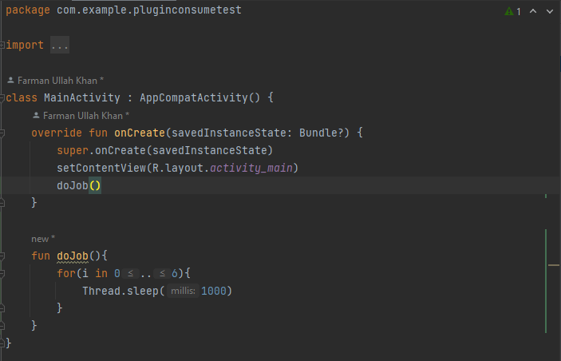
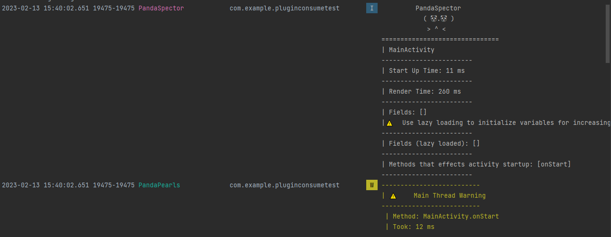
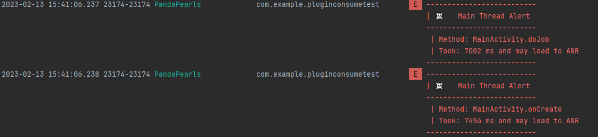

# PandaSpector
#### An Android Gradle Plugin to measure and analyze app's performance and quality. 
## Features
- Analyze activity's startup sime
- Analyze activity's layout display time
- Analyze recyclerview's rendering and measure performance
- List all those functions/methods which access main thread along with its consumed time
- Detect code bottlenecks
### Log Examples:
***Activity Code***

<a href="code.png">

</a>

***Activity Details***

<a href="log_details01.png">

</a>

***Function BottleNeck***


<a href="log_specific.png">

</a>

### Requirements(Recommanded)
- JDK 17
- Minimum AGP (Android Gradle Plugin) 7.4

**Note: Without these requirements you will get errors**

### Step 1: Apply Plugin(:app level build.gradle.kts)
```
plugins {
		...
	id("io.github.farimarwat.pandaspector") version "1.3"
}
```

### Step 2: Properties(:app level build.gradle.kts)
```
android{
....
}
//below android block in :app level build.gradle.kts
pandaspector{
    //Path to api without end slashes (required)
    apiPath = "C:\\Users\\BISMILLAH\\AppData\\Local\\Android\\Sdk\\platforms\\android-33"
    //Packages to inspect all classes and activities (required)
    packages = listOf("pk.farimarwat.timeprobeexample")
    //To inspect activity startup (optional - default is true)
    inspectStartup = true
    //To inspect recyclerview (optional - default is true)
    inspectRecyclerview = true 
    //To inspect all methods of selected package classes (optional - default is true)
    monitorMainThread = true
    //To Anr Threshold Time in milliseconds (optionl - default is 5000)
    anrThreshold = 5000
}
```

***Note: Plugin has been uploaded to gradle plugin portal and is waiting for approvel. So the whole process will not work at the moment***
